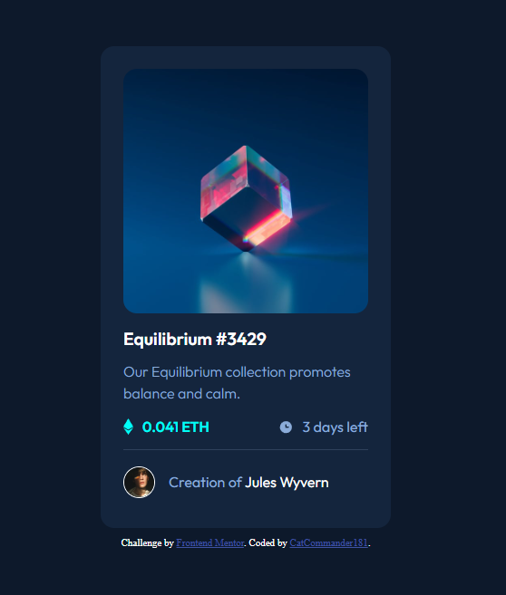

# Frontend Mentor - NFT preview card component solution

This is a solution to the [NFT preview card component challenge on Frontend Mentor](https://www.frontendmentor.io/challenges/nft-preview-card-component-SbdUL_w0U). Frontend Mentor challenges help you improve your coding skills by building realistic projects.

## Table of contents

- [Overview](#overview)
  - [The challenge](#the-challenge)
  - [Screenshot](#screenshot)
  - [Links](#links)
- [My process](#my-process)
  - [Built with](#built-with)
  - [What I learned](#what-i-learned)
  - [Continued development](#continued-development)
  - [Useful resources](#useful-resources)
- [Author
  ](#author)

## Overview

### The challenge

Users should be able to:

- View the optimal layout depending on their device's screen size
- See hover states for interactive elements

### Screenshot




### Links

- Solution URL: [Add solution URL here](https://your-solution-url.com)
- Live Site URL: [Add live site URL here](https://your-live-site-url.com)

## My process

### Built with

- Semantic HTML5 markup
- CSS custom properties
- Flexbox
- Mobile-first workflow

### What I learned

I learned how to combine `::after` pseudo-elements with `:hover` pseudo-class using the `<a>` tag .

I realized also that i can't do that using the `` tag .

To see how you can add code snippets, see below:

```css
section figure a:hover::after {
  content: url("../images/icon-view.svg");
  cursor: pointer;
  z-index: 100;
  position: absolute;
  top: 0;
  left: 0;
  width: 100%;
  display: flex;
  justify-content: center;
  align-items: center;
  height: 100%;
}
```

### Continued development

I found that i should practice css grid more because it's been a long time i'm not using it .

### Useful resources

- [GeeksForGeeks](https://www.geeksforgeeks.org/how-to-write-hover-condition-for-abefore-and-aafter-in-css/) - This helped me for knowing how to combine hover with after pseudo-element . I understand that i should `<a>` tag to make it .

## Author

- Frontend Mentor - [@Fcommander181](https://www.frontendmentor.io/profile/Fcommander181)
